# adigrams

Draw boxes in ascii...

```
$ cat logo
  +------------+
  | ADIGRAMS   |
  |        +---+------+
  |        | 4 |      |
  +--------+---+      |
           |    LYFE  |
           +----------+
```

...and turn them into Unicode:

```
$ adigrams < logo
  ┌────────────┐
  │ ADIGRAMS   │
  │        ┌───┼──────┐
  │        │ 4 │      │
  └────────┼───┘      │
           │    LYFE  │
           └──────────┘
```

## Editor Filter

`adigrams` is a tool to help create text based diagrams.  It's not part of a compile
chain – you use it to generate
original files which you keep, as opposed to building diagram files from "source".
In the same way that `inkscape` helps you create an SVG, `adigrams` helps you create text.

You can use `adigrams` as a text filter in your editor and do conversions while you build
your diagram.  Here it is in `vim`, using the `[filter]` feature in that editor:



## Examples

### Lines

Lines must occupy two adjacent chars:

```
--- horizontal |
      vertical |
    - minus
      pipe |
```

```
─── horizontal │
      vertical │
    - minus
      pipe |
```


### Line Style

Different characters produce different line thickness:

```
dsh reg thk dbl
;;; --- ___ ===
 :   |   !   H
 :   |   !   H

```

```
dsh reg thk dbl
╌╌╌ ─── ━━━ ═══
 ╎   │   ┃   ║
 ╎   │   ┃   ║
```


### Boxes

Box corners can be either square (`+`) or rounded (`*`):

```
+---+  +___+  +===+  +===+  *---*  *===*
|reg|  !thk!  HdblH  !lol|  |crv|  !lol!
+---+  +___+  +===+  +---+  *---*  *===*
```

```
┌───┐  ┏━━━┓  ╔═══╗  ?═══╕  ╭───╮  ╭═══╮
│reg│  ┃thk┃  ║dbl║  ┃lol│  │crv│  ┃lol┃
└───┘  ┗━━━┛  ╚═══╝  ┖───┘  ╰───╯  ╰═══╯
```

Not all combinations of line thickness are available with the standard Unicode
box drawing characters.

For curved corners, only the regular line thickness is available.
